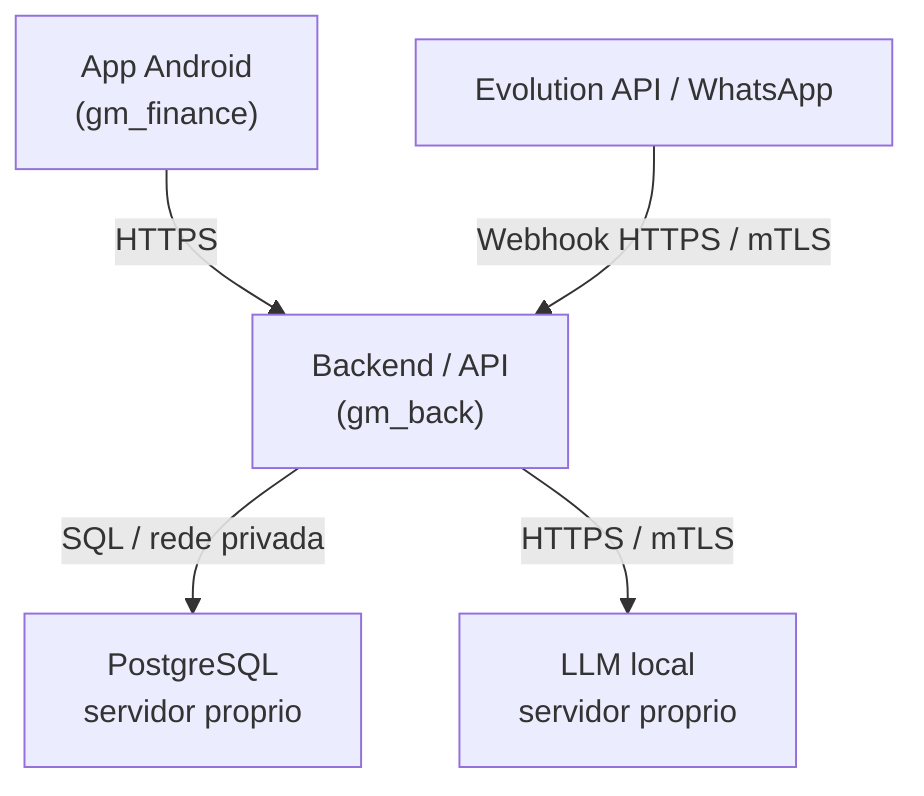
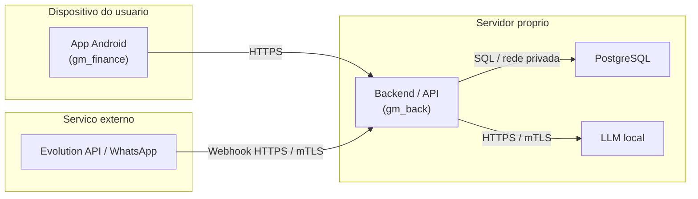

# Diagrama Tecnico - GM Finance

Este diagrama pode ser usado em documentacao Markdown com suporte a Mermaid.

## Versao com agrupamento por ambiente

## Observacao para PDF

O diagrama aparece corretamente no PDF somente se a ferramenta que gerar o PDF tiver suporte a Mermaid.

Funciona bem em ferramentas como:

- Markdown Preview Mermaid Support no VS Code, exportando depois para imagem/PDF.
- Mermaid CLI, gerando PNG ou SVG antes de inserir no PDF.
- Documentacoes baseadas em MkDocs, Docusaurus ou GitHub Pages com Mermaid habilitado.

Se o gerador de PDF nao suportar Mermaid, o ideal e exportar o diagrama para SVG ou PNG e inserir a imagem no documento final.
